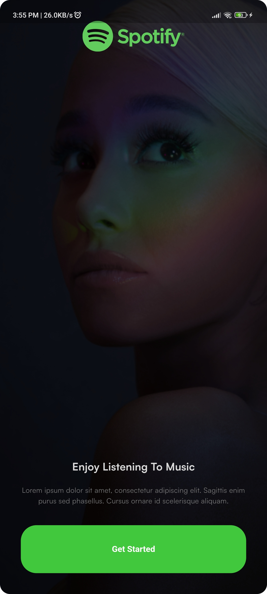
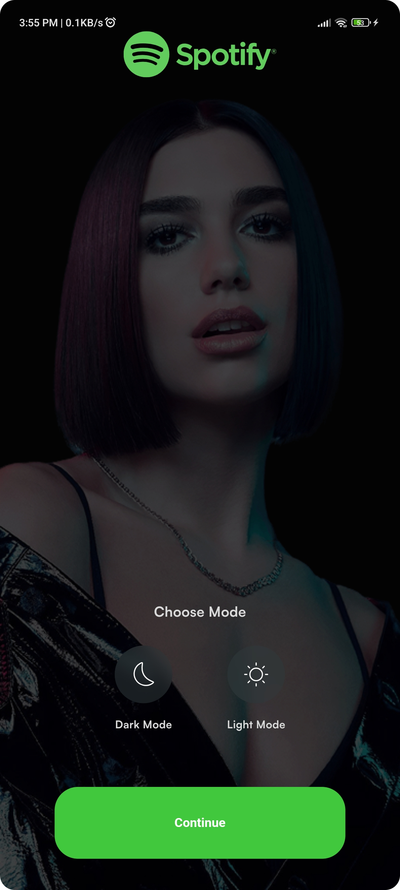
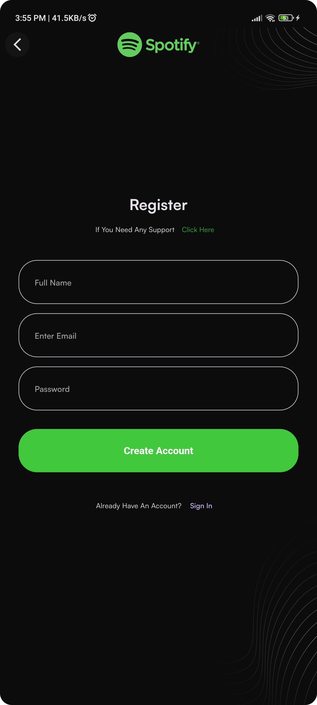
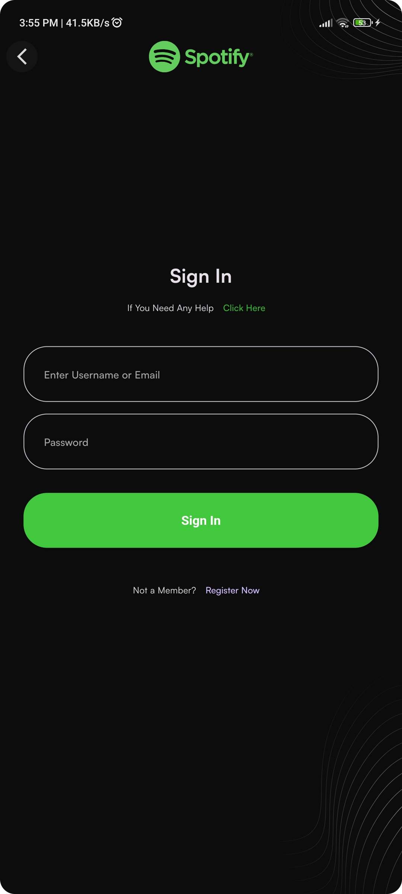
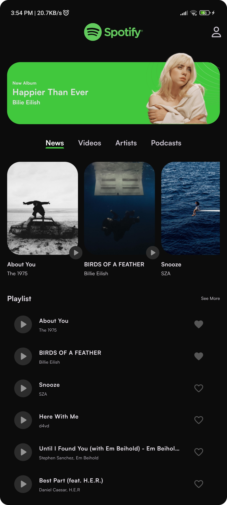

# Spotify Flutter Clone 🎧

A Spotify-inspired music streaming app built with Flutter, using Clean Architecture, BLoC/Cubit for state management, Firebase for authentication, and Supabase for backend data.

> This is a personal/learning project built for practicing Flutter, Clean Architecture, and state management — not affiliated with or endorsed by Spotify.

## Screenshots

<p align="center">
  
  
  
  
  
  
  
</p>

## Features

- 🌀 Animated splash screen
- 👋 Onboarding / "get started" flow
- 🔐 Register and login with Firebase Authentication
- 🏠 Home screen with playlists and new/featured songs
- 🎵 Song player with playback controls
- ❤️ Favorite songs (add/remove, synced per user)
- 👤 Profile page with a user's favorite songs
- 🌗 Light/dark theme toggle, persisted across sessions

## Tech Stack

- **Framework:** [Flutter](https://flutter.dev) (Dart)
- **State management:** [flutter_bloc](https://pub.dev/packages/flutter_bloc) (Cubit) + [hydrated_bloc](https://pub.dev/packages/hydrated_bloc) for persisted state (e.g. theme)
- **Auth:** [Firebase Auth](https://firebase.google.com/docs/auth)
- **Database:** [Cloud Firestore](https://firebase.google.com/docs/firestore) & [Supabase](https://supabase.com/)
- **Dependency injection:** [get_it](https://pub.dev/packages/get_it)
- **Functional error handling:** [dartz](https://pub.dev/packages/dartz) (`Either`)
- **Audio playback:** [just_audio](https://pub.dev/packages/just_audio)
- **UI:** [flutter_svg](https://pub.dev/packages/flutter_svg), [marquee](https://pub.dev/packages/marquee), [font_awesome_flutter](https://pub.dev/packages/font_awesome_flutter)

## Architecture

The project follows a **Clean Architecture** approach, split into three layers:

```
lib/
├── core/            # App-wide config: theme, colors, assets, base usecase
├── common/          # Shared widgets/blocs reused across features
├── data/            # Models, data sources (Firebase/Supabase), repository implementations
├── domain/          # Entities, repository contracts, usecases (business logic)
├── presentation/    # UI: pages, widgets, and blocs/cubits per feature
│   ├── splash/
│   ├── intro/
│   ├── auth/
│   ├── home/
│   ├── song_player/
│   ├── profile/
│   └── choose_mode/
├── service_locator.dart   # get_it dependency injection setup
├── supabase.dart          # Supabase client initialization
└── main.dart               # App entry point
```

Each feature under `domain/` and `data/` is organized by responsibility (e.g. `auth`, `song`), and `presentation/` mirrors that by screen/feature, with each feature owning its own Cubit(s) and pages/widgets.

## Getting Started

### Prerequisites

- [Flutter SDK](https://docs.flutter.dev/get-started/install) (Dart SDK `^3.5.4`)
- A Firebase project (for Authentication + Firestore)
- A Supabase project (for additional backend data)

### Setup

1. **Clone the repo**
   ```bash
   git clone https://github.com/mua-restinpeace/spotify-flutter-clone.git
   cd spotify-flutter-clone
   ```

2. **Install dependencies**
   ```bash
   flutter pub get
   ```

3. **Configure Firebase**

   This project uses `firebase_options.dart`, generated via the [FlutterFire CLI](https://firebase.google.com/docs/flutter/setup). If you're setting up your own Firebase project, run:
   ```bash
   dart pub global activate flutterfire_cli
   flutterfire configure
   ```
   This will regenerate `lib/firebase_options.dart` for your own Firebase project, and enable **Email/Password Authentication** and **Cloud Firestore** in the Firebase console.

4. **Configure Supabase**

   Update the `url` and `publishableKey` values in `lib/supabase.dart` with your own Supabase project credentials (found in your Supabase project's API settings).

5. **Run the app**
   ```bash
   flutter run
   ```

## Project Status

This project is a work in progress and built for learning purposes. Contributions, suggestions, and issues are welcome.
